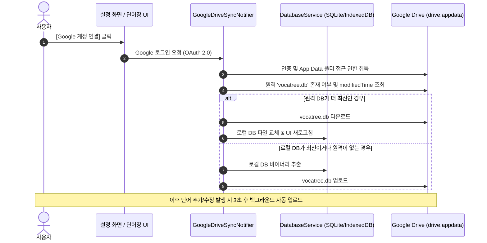

# ☁️ Google Drive 데이터베이스 동기화 구현 계획서

본 계획서는 VocaTree(Linguistic Cabinet) 앱의 데이터를 사용자의 구글 드라이브(Google Drive)에 안전하게 백업 및 동기화하기 위한 최종 아키텍처 사양 및 구현 단계입니다.

---

## 🎯 확정된 아키텍처 및 디자인 사양

| 항목 | 선택된 사양 | 설명 |
| :--- | :--- | :--- |
| **저장 위치** | `drive.appdata` | 사용자 구글 드라이브의 **앱 전용 숨김 폴더** (실수 삭제 방지 및 깔끔한 관리) |
| **데이터 포맷** | `vocatree.db` (SQLite DB) | 전체 데이터베이스 파일 바이너리 통째로 업로드/다운로드 (스키마/복습데이터 완전 보존) |
| **동기화 시점** | Hybrid Auto-Sync | 앱 시작/종료 시 + CUD(생성/수정/삭제) 후 3~5초 뒤 백그라운드 업로드 + [지금 동기화] 버튼 |
| **충돌 처리** | Last-Write-Wins | 파일의 타임스탬프(`modifiedTime`) 기준 최신 버전 자동 덮어쓰기 |
| **사용자 UX** | 선택적 설정 (Opt-in) | [설정] 화면에서 구글 계정 연결 제공 (미연결 시 기본 로컬 IndexedDB/SQLite 동작) |

---

## 🏗️ 시스템 아키텍처 구조

---

## 🛠️ 단계별 개발 타스크 목록

### Phase 1: 개발 환경 및 디펜던시 구성
- [ ] `pubspec.yaml` 패키지 추가: `google_sign_in: ^6.2.1`, `googleapis: ^13.2.0`, `http: ^1.2.0`
- [ ] Google Cloud Console OAuth 2.0 클라이언트 ID 등록 (Web / Desktop PKCE / Android)
- [ ] Web 지원용 Google Identity Services 스크립트 점검 (`web/index.html`)

### Phase 2: 인증 및 구글 드라이브 서비스 구현 (`lib/shared/services/`)
- [ ] `GoogleAuthService`: 로그인, 로그아웃, 토큰 자동 갱신 및 인증 상태 스트림 구현
- [ ] `GoogleDriveService`:
  - `drive.appdata` 폴더 내 `vocatree.db` 검색 및 메타데이터 조회
  - 파일 업로드 및 다운로드 (Stream / Bytes 전송)

### Phase 3: 동기화 엔진 구현 (`lib/features/settings/data/services/`)
- [ ] `GoogleDriveSyncService`:
  - 로컬 DB 바이너리 읽기 및 교체 로직
  - 디바운스(3~5초 Timer) 기반의 백그라운드 자동 업로드
  - 타임스탬프 비교 기반 `Last-Write-Wins` 충돌 해결

### Phase 4: UI 및 상태 관리 연동 (`lib/features/settings/presentation/`)
- [ ] `settings_screen.dart` 내 "Google Drive 동기화" 카드 섹션 구현
  - Google 계정 연결/해제 버튼 및 계정 이메일 표시
  - 동기화 상태 표시 (마지막 동기화 시각, 동기화 진행 중 인디케이터)
  - [지금 동기화] 수동 실행 버튼

### Phase 5: 검증 및 테스트
- [ ] 웹(Web / Vercel) 환경에서의 구글 로그인 및 IndexedDB/Drive 동기화 검증
- [ ] 리눅스(Linux Desktop) 환경에서의 동기화 동작 확인
- [ ] 오프라인 ➡️ 온라인 전환 시 데이터 보존 및 예외 처리 검증
